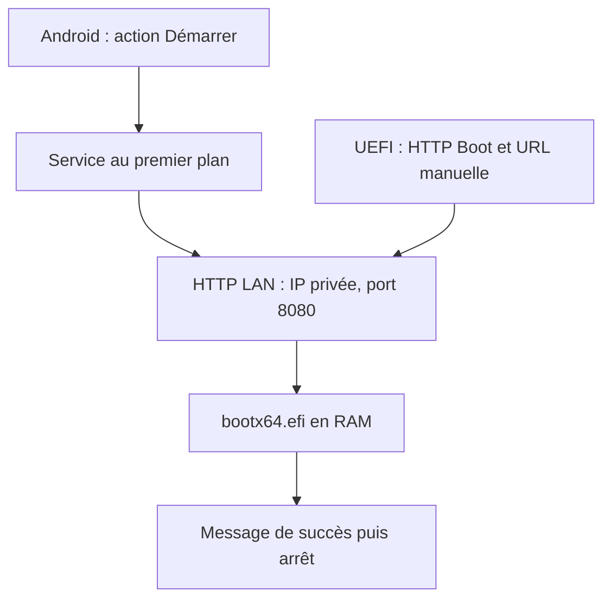
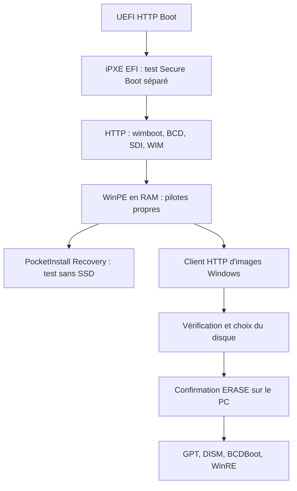

# Architecture retenue

## POC sans accès disque

Le routeur fournit DHCP et transporte le trafic entre téléphone et PC. Le firmware
assure IP/TCP/HTTP et lance l'image ; l'application EFI n'implémente ni serveur,
ni pile réseau autonome et n'utilise aucun protocole disque. Les requêtes reçues par le téléphone
indiquent un téléchargement, pas un accusé d'exécution.

Le premier serveur de développement et le serveur Android exposent le même contrat :

| Élément | Contrat POC |
|---|---|
| Adresse | IPv4 RFC1918 choisie ; bind à cette adresse, jamais `0.0.0.0` sur Android |
| URL | `http://<ip>:8080/<session>/bootx64.efi` |
| Méthodes | GET et HEAD uniquement |
| Fichiers | Liste explicite de ressources ; aucune navigation de répertoire |
| Réponse | Longueur connue, `application/efi`, pas de compression ni redirection |
| Range | Une plage en octets ; 206/416, téléchargement en streaming |
| Session | Aléatoire, 128 bits ; invalidée à l'arrêt |
| Clients | IP distinctes récentes ; aucune identification fiable d'un PC |
| Expiration | 30 min absolues, même si quelqu'un envoie des requêtes |
| Sécurité | Read-only ; clients limités au sous-réseau choisi ; aucune commande distante |

La session est un obstacle aux accès opportunistes, pas un chiffrement ni une
preuve d'authenticité : HTTP est visible sur le LAN. Ne pas porter ce prototype
sur un réseau public ou créer un port forwarding.

## Application Android

`MainActivity` (Compose) observe `ServerSnapshot` via StateFlow. `PocketInstallService`
possède le serveur, le timer, la notification et le wake lock borné. `LanNetwork`
choisit un réseau Wi-Fi/Ethernet et son IPv4 privée via ConnectivityManager et
LinkProperties ; aucun choix d'IP mobile/VPN. Le changement ou la perte de réseau
arrête le serveur pour ne pas afficher une URL obsolète.

`server-core` est un module Kotlin/JVM sans dépendance Android. Il valide les
requêtes, limite en-têtes/concurrence/temps d'attente et sert une liste de ressources.
Cela permet de vérifier **le même serveur que l'APK** sur le poste de développement.
L'adaptateur Android embarque seulement le POC EFI comme asset ; un import WinPE
volumineux via SAF et une copie atomique en stockage privé sont des étapes futures.

## Étape WinPE distincte

`bootx64.efi` du POC **ne charge pas WinPE**. L'étape suivante utilise un iPXE
préparé séparément, avec un script embarqué ou une entrée manuelle de l'URL du script.
Le script construit une base HTTP explicite et fournit les noms virtuels attendus
par wimboot. Les ressources Microsoft sont construites par l'utilisateur avec ADK.
Le serveur Android livré n'expose pas encore ce bundle.

L'interface firmware Wi-Fi peut ne pas être réutilisable par iPXE. WinPE stock ne
propose pas une connexion Wi-Fi générale. La première intégration Windows demande
donc Ethernet côté PC ; le téléphone reste Wi-Fi. Une voie Linux de récupération
avec pilotes Wi-Fi est une piste future, avec ses propres contraintes de handoff.

## Installation et extensions prévues

Modules futurs : `ImageCatalog`, `OfficialMediaImporter`, `ImageVerifier`,
`RecoveryClient`, `DiskInventory`, `DestructivePlan`, `DeploymentExecutor`,
`ProfilePlanner`. Une opération destructive est un plan local typé. Aucune
instruction shell venant du téléphone ou d'une requête HTTP n'est exécutée.

Le catalogue contient version, langue, architecture, index d'édition réel, taille,
provenance du média et SHA-256. Le manifeste reçu en HTTP n'est pas à lui seul une
racine de confiance : les hashes attendus doivent être vérifiés par une source
indépendante ou un manifeste signé avec une clé épinglée dans Recovery.

L'image doit être disponible sur un volume local/RAM avant `/Apply-Image`. Il faut
dimensionner ce staging, protéger les données puis traiter les échecs de transfert,
d'alimentation et de disque. Un staging sur le SSD cible exige déjà la confirmation.

Profils Clean/Gaming/Dev/Custom : déclarations d'options, validation des dépendances,
diff lisible, DISM/Appx/unattend documentés et tâches locales post-install facultatives.
Un script de profil ne peut ni contourner `DestructivePlan` ni réparer le boot à
distance sans confirmation sur le PC.

## Transport USB optionnel

À partir du POC 0.1.2, l'utilisateur peut choisir le réseau downstream du partage
USB Android. Le serveur et l'EFI sont les mêmes ; seul le transport change.

Le système Android active la fonction USB et DHCP après une action manuelle dans
les paramètres. PocketInstall ne pilote ni le contrôleur USB ni un stockage bloc.
Les candidats USB sont découverts par NetworkInterface, car ils peuvent ne pas
être des Network ConnectivityManager. L'identifiant de sélection inclut
interface/IP/préfixe ; le service le revalide avant de lier le serveur.
Une surveillance toutes les secondes ferme la session si le candidat disparaît.

La reconnaissance du périphérique réseau USB et HTTP Boot dans l'UEFI reste
une condition indépendante, impossible à certifier depuis le téléphone.
La suite WinPE et ses pilotes USB ne sont pas validés par ce changement.
