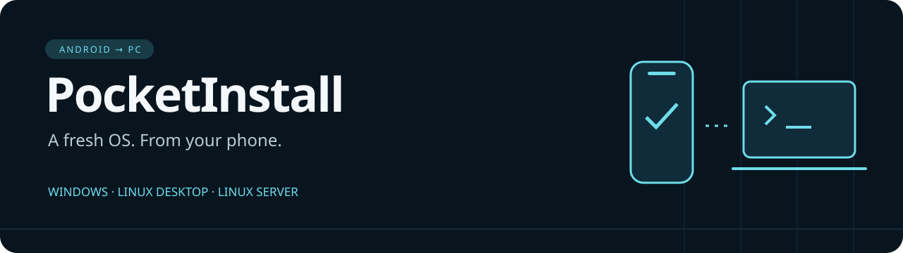

<p align="center"></p>
<p align="center"><strong>Install Windows or Debian from your Android phone over your local network.</strong></p>
<p align="center">Android 8+ · UEFI x64 · Ethernet-connected PC · No phone root required</p>
<p align="center"><a href="https://github.com/P1kaCat/PocketInstall/releases/tag/v3.4.1"><strong>Download 3.4.1</strong></a> &nbsp; · &nbsp; <a href="docs/WINPE_FREEBOX.md">Freebox setup</a> &nbsp; · &nbsp; <a href="CONTRIBUTING.md">Contribute a feature</a></p>

---

## Pick your next OS

| Windows | Linux desktop | Linux server |
|:---|:---|:---|
| Windows 10 / 11, Home / Pro | Debian 13 with Xfce | Debian 13 without a graphical desktop |
| Edition selection and optional debloat | A lightweight everyday desktop | Standard tools and SSH |
| Official Microsoft installation media | Official Debian boot files | Same boot files, server profile |

**Prepare → Install → follow progress.** The Library lists downloaded environments and images and lets you remove local copies. Tap **? Help** for explanations; technical logs and manual commands stay in Diagnostics.

## Get started

1. Install [PocketInstall-3.4.1.apk](https://github.com/P1kaCat/PocketInstall/releases/download/v3.4.1/PocketInstall-3.4.1.apk) on your phone.
2. In **Prepare**, choose Windows, Linux desktop, or Linux server.
3. For Linux, choose **Download Debian**. For Windows, download/import WinPE, then prepare your official Microsoft image. The ZIP is downloaded and imported automatically from the public GitHub release; no GitHub account is required.
4. Review the actual download size and source, then confirm. If the size is unavailable or changes, PocketInstall blocks the transfer instead of downloading silently.
5. Connect your phone to Wi-Fi and your PC to the same router using Ethernet. In **Install**, start the server.
6. Boot the PC using **UEFI PXE IPv4** and finish installation choices on the PC.

> Configure the router manually **once**: place `snponly.efi` and the app's exported `pocketinstall.ipxe` in its TFTP folder; configure DHCP with the router's TFTP IP and `snponly.efi` as the boot filename. If automatic PocketInstall boot already works, keep those settings. Reserve your phone's IP.

Debian boot files are roughly 55 MiB; the confirmation shows the current exact total. The PC downloads installation packages separately over the Internet. Linux does not need WinPE.

**Windows installation erases the selected disk only after confirmation on the PC. Back up anything you need first.** An interrupted deployment can leave that disk without a working OS.

## Sources and provenance

Windows ISOs come directly from Microsoft's approved HTTPS media hosts. The [WinPE ZIP](https://github.com/P1kaCat/PocketInstall/releases/tag/v3.2.0) is prepared by PocketInstall from [Microsoft ADK and the WinPE add-on](https://learn.microsoft.com/en-us/windows-hardware/get-started/adk-install), with iPXE/wimboot boot components. Microsoft does not publish a PocketInstall ZIP. Source attribution does not grant redistribution rights; applicable third-party terms still apply. Windows is a Microsoft product. PocketInstall is not affiliated with or endorsed by Microsoft.

## What progress actually proves

A completed file transfer does not prove an OS has started. PocketInstall distinguishes iPXE contact, file delivery, a WinPE/Debian installer runtime signal, and installation progress. First boot must be observed on the PC when its runtime signal is unavailable.

Windows installation reached first boot on the development PC. Debian validation covers both profiles' HTTP routes and actual installer startup in a diskless VM; a complete physical Linux installation is still unverified. Firmware and network-driver compatibility vary. Supplied loaders are not Secure Boot signed.

## Documentation

| Task | Guide |
|:---|:---|
| Choose Windows, storage and debloat | [Windows installation](docs/WINDOWS_INSTALL.md) |
| Install Debian desktop or server | [Linux installation](docs/LINUX_INSTALL.md) |
| Configure DHCP/TFTP once | [Freebox guide](docs/WINPE_FREEBOX.md) |
| Understand hardware and network limits | [Compatibility](COMPATIBILITY.md) · [Security](SECURITY.md) |
| Add a distribution or feature | [Contributing](CONTRIBUTING.md) |
| Inspect validation and changes | [Validation](docs/VALIDATION.md) · [Releases](https://github.com/P1kaCat/PocketInstall/releases) |

## Development

The repository includes the Android/Compose app, shared Kotlin server, Windows deployment scripts, build tools and historical evidence. Use JDK 17, Android SDK 36 and Build Tools 36.0.0. Build the diagnostic EFI with GNU-EFI (`make -C boot`, then `python3 scripts/sync_android_boot.py`). Copy the release's `snponly.efi` into `android/app/src/main/assets/boot/`; its corresponding source archive accompanies the release.

```sh
cd android
bash gradlew :server-core:test :app:assembleDebug :app:lintDebug
```

GitHub APKs are development builds. A signed release AAB, privacy documentation, Play Console declarations and Microsoft redistribution review are still required before Google Play submission.

## License and contributions

**Personal use is allowed. Republishing or distributing modified versions requires written permission.** Original PocketInstall code may be changed only to prepare a contribution to the official repository, under [LICENSE](LICENSE) and [CONTRIBUTING.md]. For example: develop a distribution profile, test it privately, then submit a pull request.

The proprietary license covers original elements expressly licensed under it from 3.4.0 onward. Earlier grants and third-party rights remain intact. See [Licensing and notices](docs/LICENSING.md).
