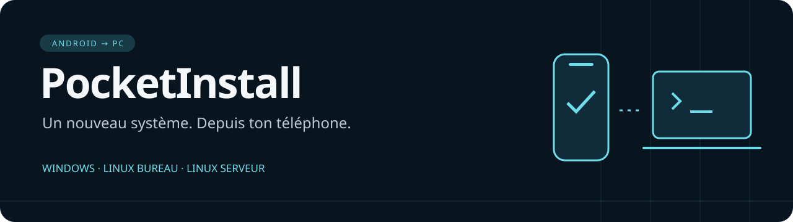

<p align="center"></p>
<p align="center"><strong>Installe Windows ou Debian depuis un téléphone Android, via le réseau local.</strong></p>
<p align="center">Android 8+ · UEFI x64 · PC en Ethernet · Téléphone sans root</p>
<p align="center"><a href="https://github.com/P1kaCat/PocketInstall/releases/tag/v3.4.0"><strong>Télécharger la 3.4.0</strong></a> &nbsp; · &nbsp; <a href="docs/WINPE_FREEBOX.md">Configurer la Freebox</a> &nbsp; · &nbsp; <a href="CONTRIBUTING.md">Proposer une fonctionnalité</a></p>

---

## Choisis ton prochain système

| Windows | Linux bureau | Linux serveur |
|:---|:---|:---|
| Windows 10 / 11, Home / Pro | Debian 13 avec Xfce | Debian 13 sans interface graphique |
| Choix de l’édition et options de débloat | Un bureau léger pour le quotidien | Outils standard et SSH |
| Image Microsoft officielle | Démarrage téléchargé depuis Debian | Même démarrage, profil serveur |

**Préparer → Installer → suivre la progression.** La bibliothèque affiche les images conservées sur le téléphone et permet de libérer leur espace. Les explications se trouvent dans les boutons **? Aide**, les journaux dans le diagnostic.

## Commencer

1. Installe [PocketInstall-3.4.0.apk](https://github.com/P1kaCat/PocketInstall/releases/download/v3.4.0/PocketInstall-3.4.0.apk) sur ton téléphone.
2. Dans **Préparer**, sélectionne Windows, Linux bureau ou Linux serveur.
3. Pour Linux, appuie sur **Télécharger Debian**. Pour Windows, appuie sur **Télécharger WinPE depuis GitHub**, puis prépare l’image Microsoft dans la section Windows. Le ZIP est récupéré et importé automatiquement ; l’accès au dépôt privé peut demander une connexion GitHub.
4. Connecte le téléphone au Wi-Fi et le PC à la même box en Ethernet. Dans **Installer**, démarre le serveur.
5. Démarre le PC en **UEFI PXE IPv4**, puis termine les choix d’installation à son écran.

> La box se configure manuellement **une seule fois** : `snponly.efi` et l’export `pocketinstall.ipxe` dans son dossier TFTP, DHCP annonçant l’IP de la box et `snponly.efi`. Si PocketInstall démarre déjà automatiquement sur ton PC, conserve ces réglages. Réserve l’IP du téléphone.

Le téléchargement Debian prépare environ 55 Mio de fichiers de démarrage ; le PC télécharge ensuite les paquets sur Internet. Linux ne nécessite pas WinPE. Les fichiers sont vérifiés avant l’activation du serveur.

## Ce que la progression confirme

Un fichier transféré ne prouve pas que le système a démarré. PocketInstall distingue la connexion iPXE, l’envoi des fichiers, le signal de WinPE ou de l’installateur Debian et la fin de l’installation. Le premier démarrage reste à constater sur le PC lorsque son signal n’est pas disponible.

L’installation Windows a été réalisée sur le PC physique de développement. La validation Debian de cette version couvre les routes des deux profils et le démarrage du véritable installateur en VM sans disque ; une installation Linux complète sur matériel physique reste à vérifier. La compatibilité dépend du firmware et des pilotes réseau du PC. Les chargeurs fournis ne sont pas signés pour Secure Boot.

## Documentation

| Pour… | Lire… |
|:---|:---|
| Installer Windows et choisir les options | [Installation Windows](docs/WINDOWS_INSTALL.md) |
| Installer Debian bureau ou serveur | [Installation Linux](docs/LINUX_INSTALL.md) |
| Préparer DHCP et TFTP | [Guide Freebox](docs/WINPE_FREEBOX.md) |
| Comprendre le réseau et ses limites | [Compatibilité](COMPATIBILITY.md) · [Sécurité](SECURITY.md) |
| Ajouter une distribution ou une fonction | [Contribuer](CONTRIBUTING.md) |
| Consulter les changements | [Releases](https://github.com/P1kaCat/PocketInstall/releases) |

## Développement

Le dépôt garde le code Android/Compose, le serveur Kotlin partagé, l’installateur Windows, les outils de préparation et les preuves historiques. Les anciens workflows propres à une version ont été retirés ; les pipelines de construction et validation restent disponibles.

Pour compiler : JDK 17, SDK Android 36 et Build Tools 36.0.0. Le petit EFI de diagnostic se construit avec GNU-EFI (`make -C boot`, puis `python3 scripts/sync_android_boot.py`). Pour Linux, ajoute le `snponly.efi` officiel de la release dans `android/app/src/main/assets/boot/` ; sa source correspondante accompagne la release.

```sh
cd android
bash gradlew :server-core:test :app:assembleDebug :app:lintDebug
```

## Licence et contributions

**Utilisation personnelle autorisée. Republication et distribution de versions modifiées interdites sans accord écrit.** Les modifications du code sont autorisées uniquement pour préparer une contribution au dépôt officiel, selon [LICENSE](LICENSE) et [CONTRIBUTING.md](CONTRIBUTING.md). Par exemple : développer un profil de distribution, le tester en privé, puis proposer une pull request.

Cette licence concerne les éléments originaux de PocketInstall à partir de cette version. Les composants tiers et les versions historiques conservent leurs propres droits. Voir [les licences et notices](docs/LICENSING.md).
